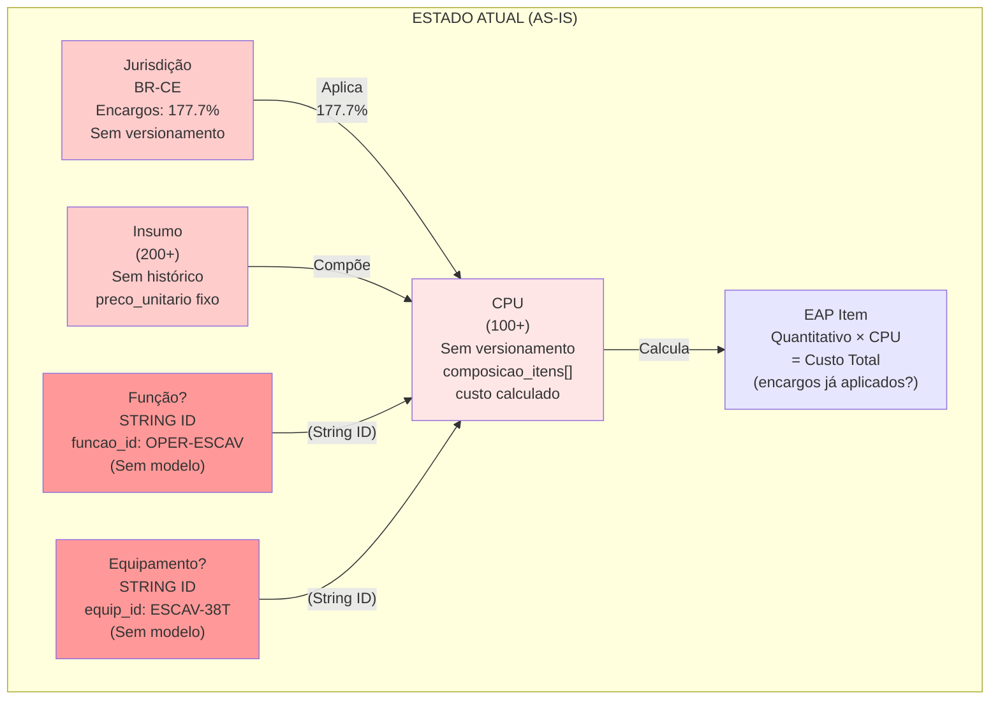
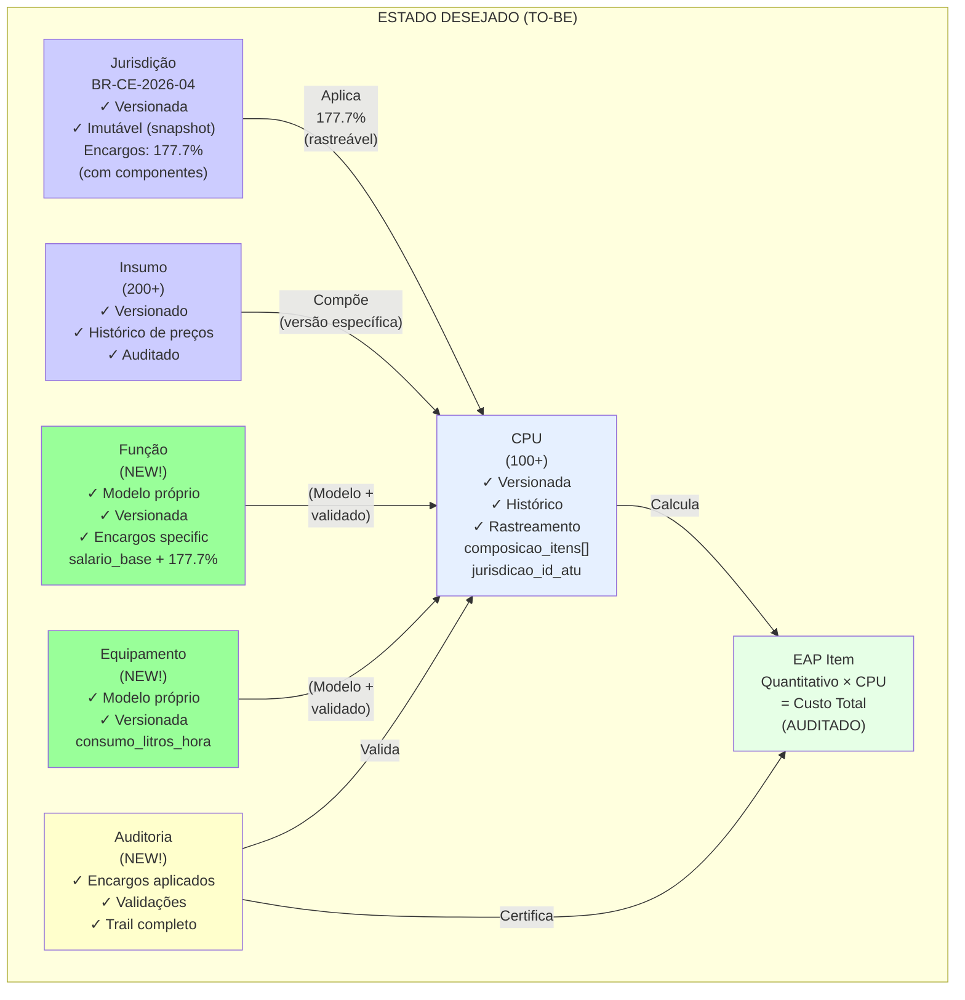
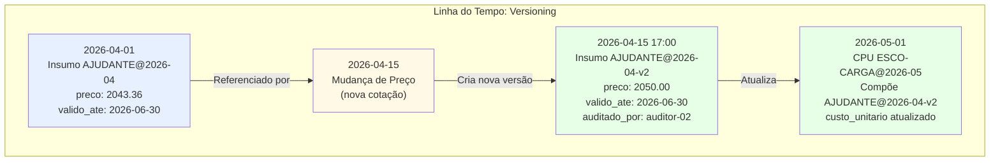
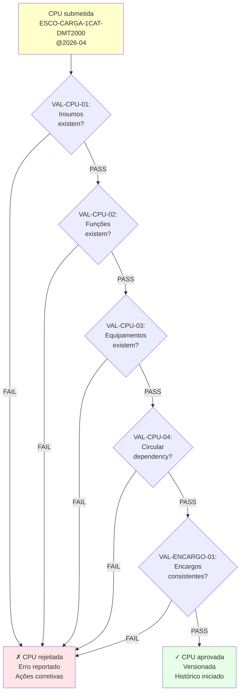

# Diagrama: Relacionamentos CPU × Insumo × Jurisdição

## AS-IS (Estado Atual)

```mermaid
graph TB
    subgraph Atual["ESTADO ATUAL (AS-IS)"]
        J["Jurisdição<br/>BR-CE<br/>Encargos: 177.7%<br/>Sem versionamento"]
        
        I["Insumo<br/>(200+)<br/>Sem histórico<br/>preco_unitario fixo"]
        
        F["Função?<br/>STRING ID<br/>funcao_id: OPER-ESCAV<br/>(Sem modelo)"]
        
        E["Equipamento?<br/>STRING ID<br/>equip_id: ESCAV-38T<br/>(Sem modelo)"]
        
        CPU["CPU<br/>(100+)<br/>Sem versionamento<br/>composicao_itens[]<br/>custo calculado"]
        
        EAP["EAP Item<br/>Quantitativo × CPU<br/>= Custo Total<br/>(encargos já aplicados?)"]
    end
    
    J -->|"Aplica<br/>177.7%"| CPU
    I -->|"Compõe"| CPU
    F -->|"(String ID)"| CPU
    E -->|"(String ID)"| CPU
    CPU -->|"Calcula"| EAP
    
    style J fill:#fcc
    style I fill:#fcc
    style F fill:#ff9999
    style E fill:#ff9999
    style CPU fill:#ffe6e6
    style EAP fill:#e6e6ff
```

## TO-BE (Estado Desejado)

```mermaid
graph TB
    subgraph Desejado["ESTADO DESEJADO (TO-BE)"]
        J["Jurisdição<br/>BR-CE-2026-04<br/>✓ Versionada<br/>✓ Imutável (snapshot)<br/>Encargos: 177.7%<br/>(com componentes)"]
        
        I["Insumo<br/>(200+)<br/>✓ Versionado<br/>✓ Histórico de preços<br/>✓ Auditado"]
        
        F["Função<br/>(NEW!)<br/>✓ Modelo próprio<br/>✓ Versionada<br/>✓ Encargos specific<br/>salario_base + 177.7%"]
        
        E["Equipamento<br/>(NEW!)<br/>✓ Modelo próprio<br/>✓ Versionada<br/>consumo_litros_hora"]
        
        CPU["CPU<br/>(100+)<br/>✓ Versionada<br/>✓ Histórico<br/>✓ Rastreamento<br/>composicao_itens[]<br/>jurisdicao_id_atu"]
        
        EAP["EAP Item<br/>Quantitativo × CPU<br/>= Custo Total<br/>(AUDITADO)"]
        
        AUDIT["Auditoria<br/>(NEW!)<br/>✓ Encargos aplicados<br/>✓ Validações<br/>✓ Trail completo"]
    end
    
    J -->|"Aplica<br/>177.7%<br/>(rastreável)"| CPU
    I -->|"Compõe<br/>(versão específica)"| CPU
    F -->|"(Modelo +<br/>validado)"| CPU
    E -->|"(Modelo +<br/>validado)"| CPU
    CPU -->|"Calcula"| EAP
    AUDIT -->|"Valida"| CPU
    AUDIT -->|"Certifica"| EAP
    
    style J fill:#ccf
    style I fill:#ccf
    style F fill:#9f9
    style E fill:#9f9
    style CPU fill:#e6f0ff
    style EAP fill:#e6ffe6
    style AUDIT fill:#ffffcc
```

## Fluxo de Versionamento (TO-BE)

```mermaid
graph TB
    subgraph Timeline["Linha do Tempo: Versioning"]
        V1["2026-04-01<br/>Insumo AJUDANTE@2026-04<br/>preco: 2043.36<br/>valido_ate: 2026-06-30"]
        
        V2["2026-04-15<br/>Mudança de Preço<br/>(nova cotação)"]
        
        V3["2026-04-15 17:00<br/>Insumo AJUDANTE@2026-04-v2<br/>preco: 2050.00<br/>valido_ate: 2026-06-30<br/>auditado_por: auditor-02"]
        
        V4["2026-05-01<br/>CPU ESCO-CARGA@2026-05<br/>Compõe AJUDANTE@2026-04-v2<br/>custo_unitario atualizado"]
    end
    
    V1 -->|"Referenciado por"| V2
    V2 -->|"Cria nova versão"| V3
    V3 -->|"Atualiza"| V4
    
    style V1 fill:#e6f0ff
    style V2 fill:#fff9e6
    style V3 fill:#e6ffe6
    style V4 fill:#e6ffe6
```

## Validações TO-BE

```mermaid
graph TB
    CPU["CPU submetida<br/>ESCO-CARGA-1CAT-DMT2000<br/>@2026-04"]
    
    V1{"VAL-CPU-01:<br/>Insumos<br/>existem?"}
    
    V2{"VAL-CPU-02:<br/>Funções<br/>existem?"}
    
    V3{"VAL-CPU-03:<br/>Equipamentos<br/>existem?"}
    
    V4{"VAL-CPU-04:<br/>Circular<br/>dependency?"}
    
    V5{"VAL-ENCARGO-01:<br/>Encargos<br/>consistentes?"}
    
    PASS["✓ CPU aprovada<br/>Versionada<br/>Histórico iniciado"]
    
    FAIL["✗ CPU rejeitada<br/>Erro reportado<br/>Ações corretivas"]
    
    CPU --> V1
    V1 -->|FAIL| FAIL
    V1 -->|PASS| V2
    V2 -->|FAIL| FAIL
    V2 -->|PASS| V3
    V3 -->|FAIL| FAIL
    V3 -->|PASS| V4
    V4 -->|FAIL| FAIL
    V4 -->|PASS| V5
    V5 -->|FAIL| FAIL
    V5 -->|PASS| PASS
    
    style CPU fill:#ffffcc
    style PASS fill:#e6ffe6
    style FAIL fill:#ffe6e6
```
